# FundTracker

FundTracker keeps a repair fund honest. If you sell things on eBay or Vinted to
pay for the parts needed to fix phones, tablets and other devices, it tracks the
money coming in against the parts you have bought and the parts you still need,
so the question "can I afford the rest of the parts?" has an answer.

It is for anyone who repairs devices as a hobby or a sideline and funds it from
second-hand sales. There are two halves:

| Part | Where | What it is |
|---|---|---|
| iOS app | `FundTracker/` | SwiftUI + SwiftData, iOS 26 or later. Where every record is created and edited: the source of truth. |
| Server | `server/` | Express + SQLite, with Caddy in front for TLS. A read-only web dashboard per account, plus an admin page at `/admin`. |

The app works fully offline. The server is optional: it gives you the same
figures in a browser, keeps several phones on one account in step, and lets a
reset or replacement phone restore its records.

## Screenshots

Everything below was captured from the running app and server. The records are
sample data (the app's `-demo` launch argument, synced to a local server); none
of it is real.

### iOS app

| Devices | Device detail | Sales | Insights |
|---|---|---|---|
| 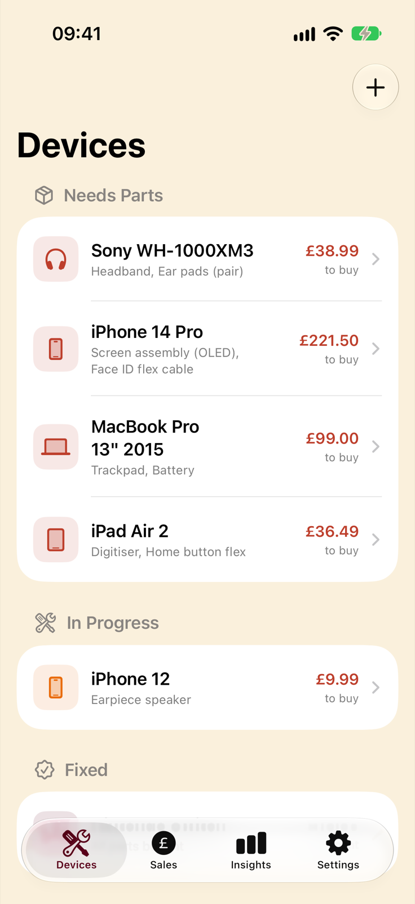 | 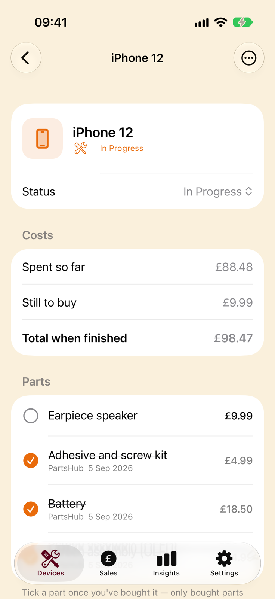 | 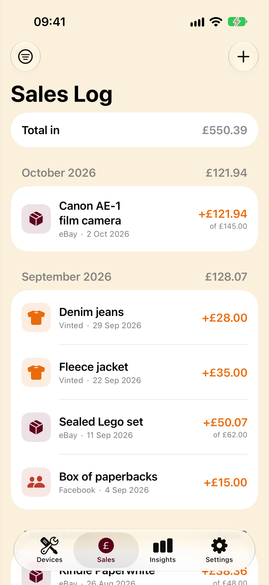 | 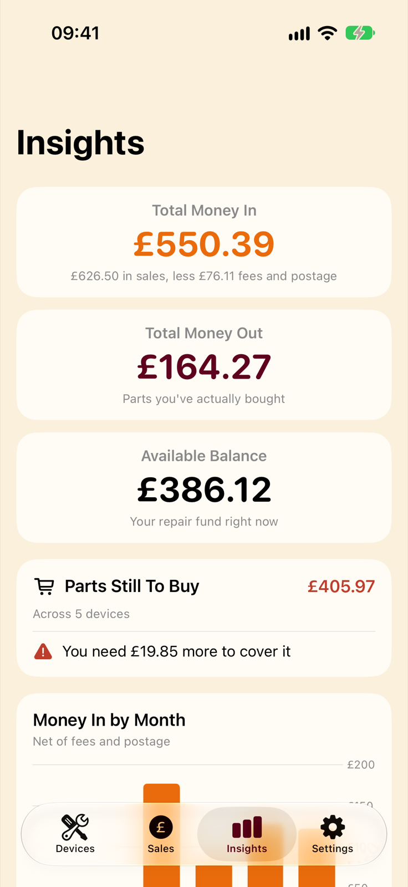 |
| Devices grouped by status, with what each still needs. | Tick parts off as you buy them. | Sales by month, net of fees and postage. | The headline figures, and whether the balance covers the outstanding parts. |

| Insights charts | First launch | Settings |
|---|---|---|
| 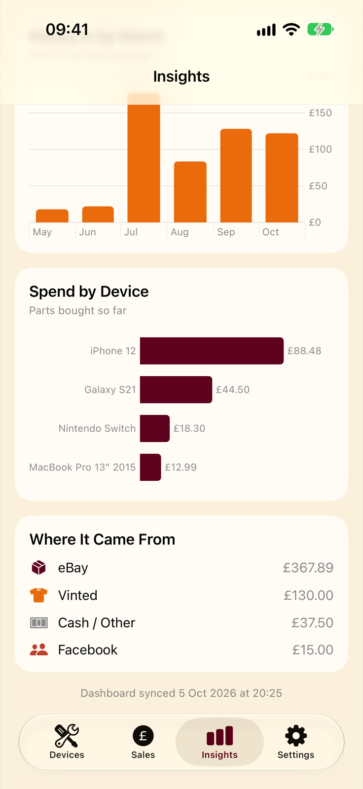 | 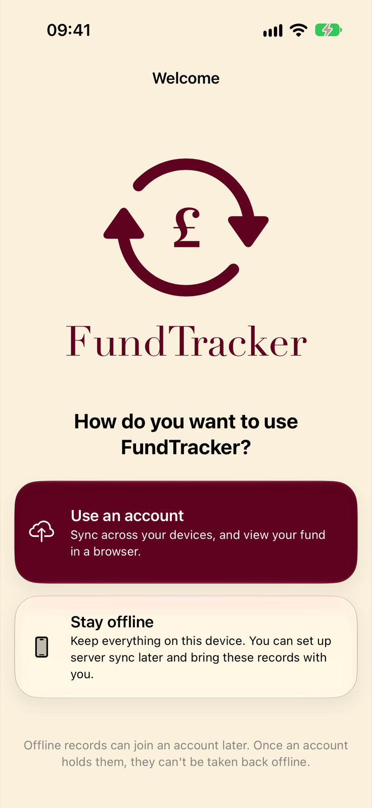 | 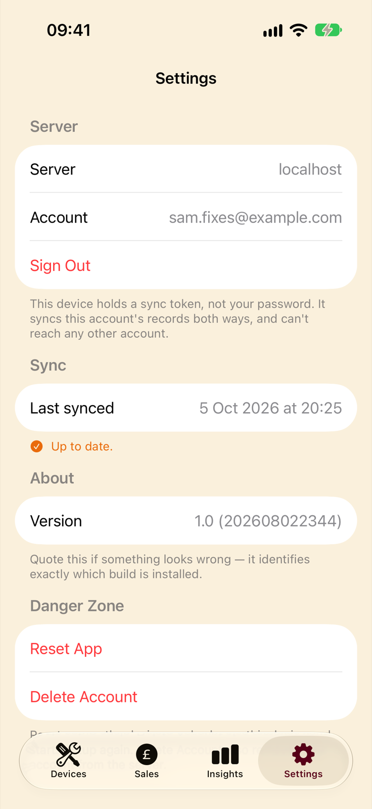 |
| Income by month, spend by device and where the money came from. | A server account is offered, never required. | Which server and account this phone syncs with. |

### Web dashboard

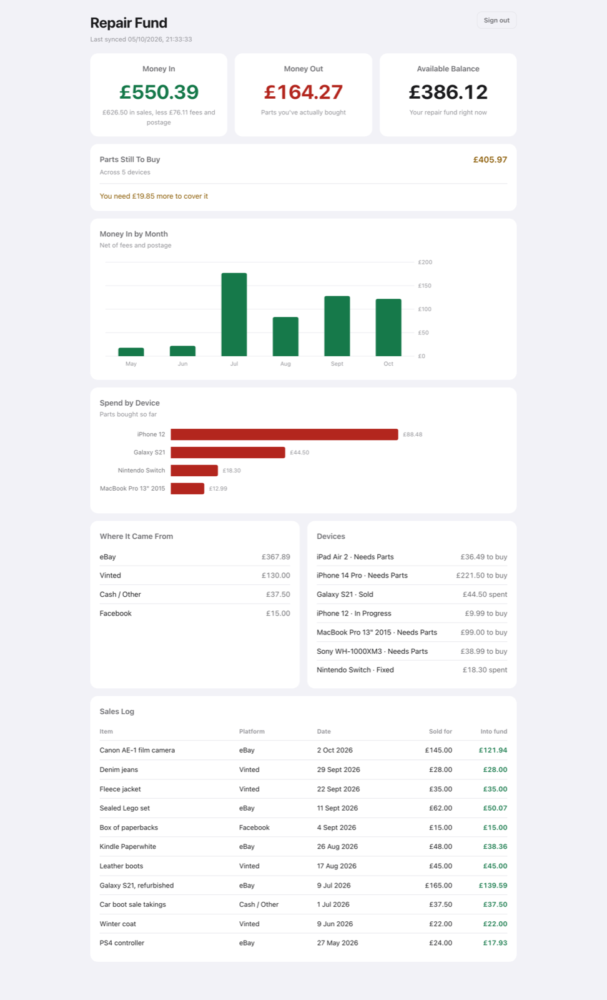

The dashboard on a desktop browser: the same figures as the app, computed on the
server from the last sync.

| Phone width | Admin |
|---|---|
| 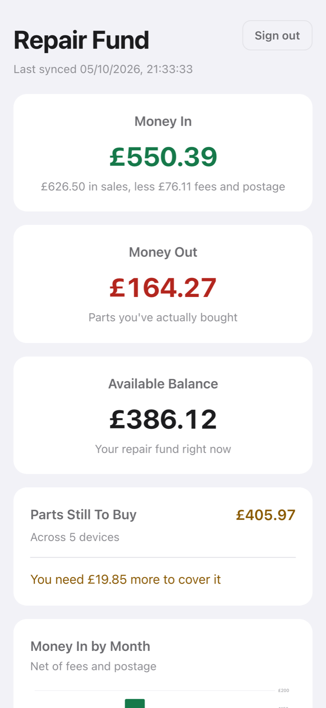 | 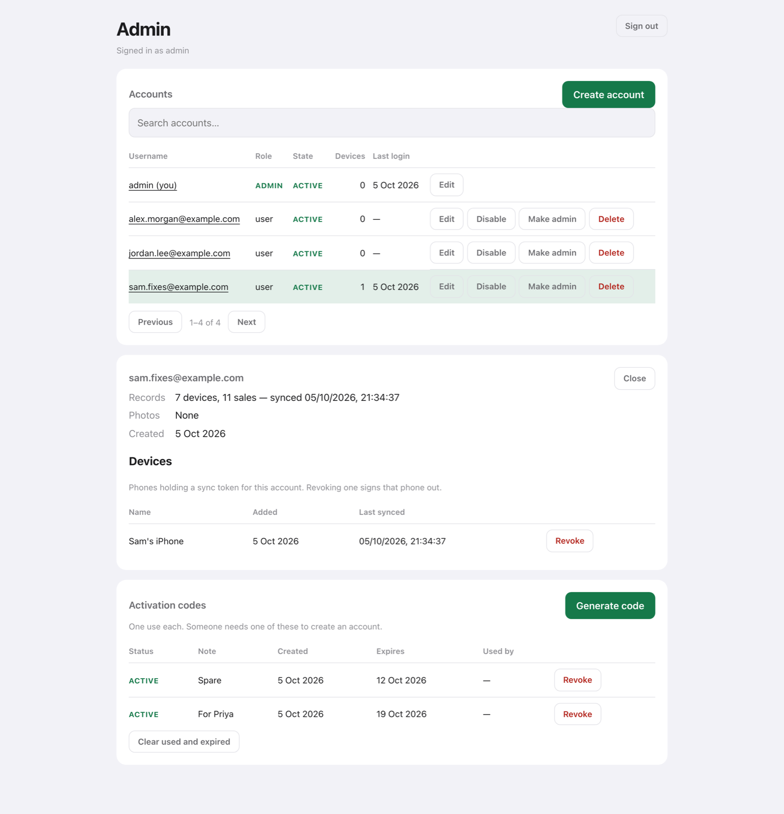 |
| The layout collapses to one column on a phone. | `/admin`: accounts, the phones signed in to each, and one-time activation codes. |

## Features

**App**

- Devices with a status (Needs Parts, In Progress, Fixed, Sold), notes, an icon
  and an optional photo.
- Parts per device with unit cost, quantity and supplier. An unbought part is a
  planned cost; ticking it off turns it into money actually spent.
- Sales with platform (eBay, Vinted, Facebook, cash, other), sale price, fees
  and postage, so the fund counts what really arrived rather than the headline
  price.
- Insights: money in, money out, available balance, parts still to buy, and a
  plain statement of whether the balance covers them. Charts for income by
  month and spend by device, plus income by platform.
- Works offline with no account. Offline records can join an account later.

**Server**

- Automatic two-way sync: the app pushes after every change, every minute and
  on pull-to-refresh, and an empty device restores from the server.
- A read-only dashboard with the same figures, charts, device list and sales
  log, in light and dark mode and at phone width.
- Many accounts on one server, each with its own records, photos and any number
  of phones. Each phone holds its own revocable token, never the password.
- An admin page for accounts, roles, password resets, revoking phones and
  issuing activation codes. Registration is closed: creating an account needs a
  one-time code from an admin.

## How to run

### Prerequisites

- **Server:** Node.js 22.13 or later (it uses the built-in `node:sqlite`
  module, so there is nothing native to compile). Docker is only needed for the
  deployment set-up.
- **App:** a Mac with Xcode 26 or later and an iOS 26 or later simulator or
  device. Last built with Xcode 27.0 and run on the iOS 27.0 simulator.

### Server

```sh
cd server
npm ci
export SESSION_SECRET=$(openssl rand -hex 32)
npm start                      # http://localhost:3100
```

The first start creates an `admin` account with the password `defaultadmin`.
It can do nothing until that password is replaced, so open
`http://localhost:3100/admin`, sign in and change it. From there, create an
account for yourself (admins manage the server and have no fund of their own),
or generate an activation code and register from the app.

You can also create or reset an account from the shell. It prompts for the
password without echoing it:

```sh
node scripts/set-password.js you@example.com
node scripts/accounts.js list
```

The database and photos live in `server/data/`, which is gitignored. Keep
`SESSION_SECRET` the same between runs or every browser is signed out.

### iOS app

Open `FundTracker/FundTracker.xcodeproj` in Xcode, pick an iPhone simulator and
press Run. From the command line:

```sh
cd FundTracker
xcodebuild -project FundTracker.xcodeproj -scheme FundTracker \
  -destination 'generic/platform=iOS Simulator' -derivedDataPath build/sim build

xcrun simctl install booted build/sim/Build/Products/Debug-iphonesimulator/FundTracker.app
xcrun simctl launch booted uk.lbsi.FundTracker
```

Leave code signing on for simulator builds (Xcode signs them locally without a
developer team). A build made with `CODE_SIGNING_ALLOWED=NO` cannot write to the
Keychain, so it forgets its sign-in on the next launch.

To run on a real phone, set your own team under Signing & Capabilities, or
build the unsigned IPA for sideloading as described in
[docs/IOS-APP.md](docs/IOS-APP.md).

### Sample data

Debug builds accept a `-demo` launch argument that fills an empty install with
made-up devices, parts and sales and skips onboarding:

```sh
xcrun simctl launch booted uk.lbsi.FundTracker -demo
```

In Xcode, add `-demo` under Product > Scheme > Edit Scheme > Run > Arguments.
It only seeds an install that has no records and has never been signed in to a
server, so it cannot overwrite real data. Settings > Reset App clears it.

### Connecting the app to your server

In the app, go to Settings > Set Up Server Sync > Use an account, enter the
server address and sign in. The simulator can use a server on the same Mac at
`http://localhost:3100`. A real phone needs HTTPS on a hostname with a valid
certificate, because the app carries no App Transport Security exemptions.

Once signed in, the app pushes its records and the dashboard at
`http://localhost:3100` shows them when you sign in with the same account.

### Deploying with Docker

`server/docker-compose.yml` runs the app behind Caddy, which obtains and renews
a Let's Encrypt certificate. It needs a public hostname and ports 80 and 443.

```sh
cd server
cp .env.example .env           # set SESSION_SECRET and FUND_DOMAIN
docker compose up -d --build
```

The full runbook (deploying a change, backups, certificates, DNS and
troubleshooting) is in [docs/OPERATIONS.md](docs/OPERATIONS.md).

### Tests

There is no automated test suite yet. Verification so far has been manual; see
[docs/NEXT-STEPS.md](docs/NEXT-STEPS.md) for what should be covered first.

## Architecture

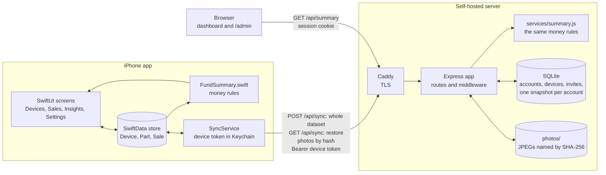

### How the dashboard gets its data

There is no export step and no shared file. The app syncs to the server over an
HTTP API, and the dashboard reads what was last synced.

1. **Records live on the phone.** Devices, parts and sales are SwiftData models
   and are only ever created or edited in the app.
2. **Signing in gets a token.** The app checks that the address really is a
   FundTracker server (`GET /api/health`), then swaps your email and password
   for a token that belongs to that one phone (`POST /api/auth/device`). The
   token goes in the Keychain; the password is not stored.
3. **The app pushes everything.** At launch, two seconds after any change,
   every minute while it is open, and on pull-to-refresh, it sends its whole
   dataset as JSON to `POST /api/sync`. The server replaces that account's
   snapshot, stored as one row in SQLite. There is no merge and no conflict
   handling, because nothing on the server edits records.
4. **Photos travel separately.** The sync payload carries only each photo's
   SHA-256. The response lists the hashes the server is missing and the app
   uploads just those to `POST /api/photos/<hash>`.
5. **The browser reads.** The dashboard is a static page. You sign in with
   email and password, receive a signed session cookie, and the page calls
   `GET /api/summary`. The server loads the snapshot, computes every figure in
   `services/summary.js` and returns it for the page to draw. There is no
   endpoint that lets a browser change fund records.
6. **Restore is the same road in reverse.** A device with no records pulls
   `GET /api/sync` before its first push, and the server refuses a push that
   would replace stored records with nothing.

The sync contract, data model and the reasoning behind them are written up in
[docs/ARCHITECTURE.md](docs/ARCHITECTURE.md).

### Money rules

| Figure | Rule |
|---|---|
| Money in | sum of each sale's price minus fees and postage |
| Money out | sum of parts marked as bought (unit cost × quantity) |
| Balance | money in minus money out |
| Still to buy | sum of parts not yet bought |
| Shortfall | balance minus still to buy; negative means the fund cannot cover the rest |

### Project layout

| Path | What is there |
|---|---|
| `FundTracker/FundTracker.xcodeproj` | The Xcode project. It uses file-system-synchronised groups, so a new `.swift` file in the folder joins the target automatically. |
| `FundTracker/FundTracker/Models.swift` | `Device`, `Part` and `Sale` SwiftData models. |
| `FundTracker/FundTracker/FundSummary.swift` | Every derived money figure. |
| `FundTracker/FundTracker/SyncService.swift`, `SyncSettings.swift`, `RemoteSnapshot.swift` | The wire format, sync calls, stored connection details and restore. |
| `FundTracker/FundTracker/PreviewData.swift`, `DemoData.swift` | Sample records for previews and the `-demo` argument. |
| `FundTracker/FundTracker/Views/` | One file per screen, plus shared components. |
| `server/server.js` | Express entry point, security headers and route mounting. |
| `server/routes/` | `auth`, `fund` (sync, summary, snapshot), `photos`, `devices`, `admin`. |
| `server/services/` | `db` (schema), `store` (snapshots), `summary` (money rules), `accounts`, `devices`, `invites`, `photos`, `bootstrap`. |
| `server/middleware/` | Device-token auth, session cookies, error handling. |
| `server/public/` | The dashboard and admin pages: plain HTML, CSS and JavaScript with no build step. |
| `server/scripts/` | Account management from the shell, for when nobody can sign in. |
| `server/Dockerfile`, `docker-compose.yml`, `Caddyfile` | The deployment set-up. |
| `docs/` | Architecture, app notes, operations runbook, decisions and next steps. |

### Two rules to remember

**`server/services/summary.js` mirrors `FundTracker/FundTracker/FundSummary.swift`.**
Both compute the same money figures. Change a rule in one and you must change it
in the other, or the app and the dashboard will quietly disagree about your
balance.

**Everything server-side hangs off `accounts.id`, never a username.** Usernames
are a label that can change at any time. Anything keyed by name breaks the moment
an account is renamed.

## Documentation

- **[docs/ARCHITECTURE.md](docs/ARCHITECTURE.md)**: how the halves fit together, the data model, the sync contract
- **[docs/IOS-APP.md](docs/IOS-APP.md)**: the app: files, screens, conventions
- **[docs/OPERATIONS.md](docs/OPERATIONS.md)**: runbook: deploy, restart, backup, certificates, DNS, troubleshooting
- **[docs/DECISIONS.md](docs/DECISIONS.md)**: why things are the way they are, including options rejected
- **[docs/NEXT-STEPS.md](docs/NEXT-STEPS.md)**: what is outstanding
- **[server/README.md](server/README.md)**: server-specific detail and endpoint reference

Hostnames, IP addresses and usernames throughout the docs are placeholders,
because this is a public repository. The real values live in
`docs/LOCAL-NOTES.md`, which is gitignored and stays on the author's machine.

## Status and limitations

Working end to end as of 2026-08-02. Since first release: per-device sync tokens
and email logins, uploaded photos, a SQLite rewrite with per-account isolation,
an admin interface with activation codes, an offline or online first-run choice,
and automatic two-way sync.

Worth knowing before relying on it:

- No automated tests. The money rules are implemented twice, in Swift and in
  JavaScript, and nothing checks that they agree.
- The dashboard is read-only by design. Records are edited in the app only.
- Sign-in, sync, Reset App and restore have been driven end to end in the
  simulator against a local server, not yet on a real phone against an HTTPS
  deployment.
- iOS 26 or later only, because the app uses the Liquid Glass button styles.
- Currency is fixed to pounds sterling.
- Sales and devices are not linked, so there is no profit-per-repair figure.
- The dashboard still uses its original green and red palette rather than the
  app's brand colours.
- Each photo is capped at 3 MB but nothing limits the total stored.
- The default `admin` password is published, so change it at first sign-in on
  any server that can be reached from outside.
